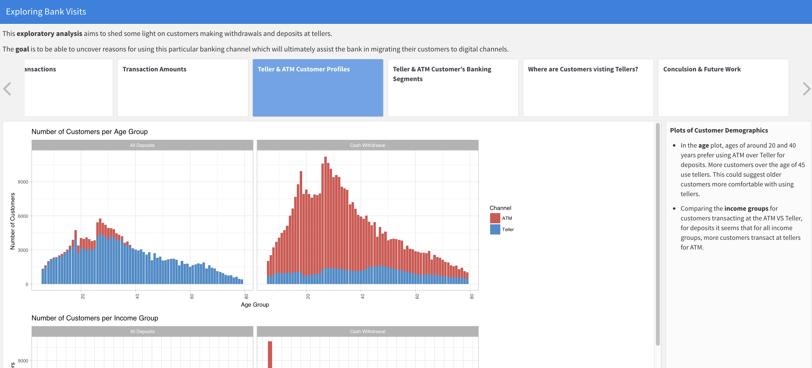

# Exploring Bank Visits

## Introduction

This was a visualization project to explore customer's visits to the bank and where they perform various transactions across the country. Even though the bank's digital channels are growing rapidly, there is still a large population of people who predominantly use bank tellers rather than digital channels in South Africa.   

## The Problem to be Solved
Providing an holistic view of bank teller activity and the customers using this channel. These insights may enable the bank to plan more effectively at certain locations as well as identify possible inefficiencies in the teller platforms.

## The Data
In this project, I will explore factors that influence customer's visits to the bank, for instance time of day, location and customer demographic information. I will also look at the transactions they perform, specifically looking at cash deposits and cash withdrawals.  The data has been masked for security reasons. I have used R markdown to create an interactive HTML document which has a storyboard type style. I made used of the library leaflet for the mapping of tellers with geocoded data.

