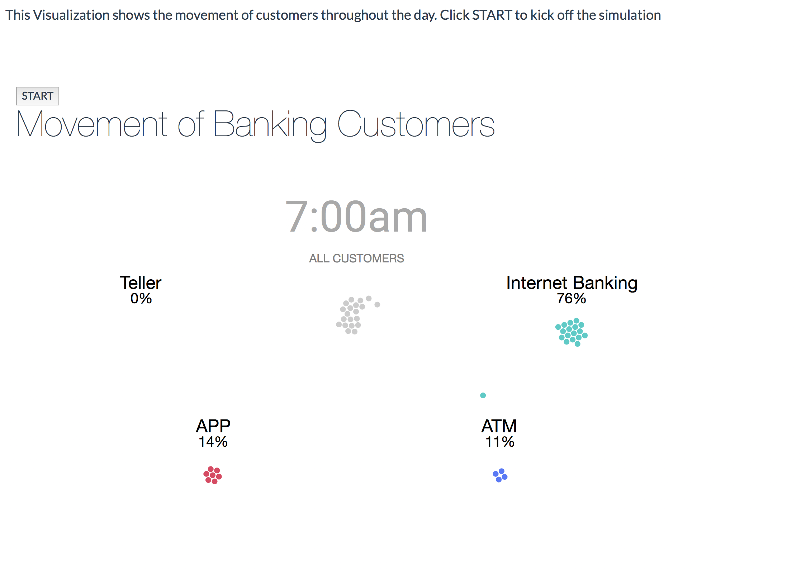

# Moving bubbles in D3.js

 I was inspired by the Day in the Life of An American by Nathan Yau to create moving bubbles to represent people's activities throughout the day.  
 I used this tutorial to learn D3.js basics.  
 https://flowingdata.com/2015/12/15/a-day-in-the-life-of-americans/  
 I used hypothetical customer's data to show their activities at various banking channels throughout the day.

